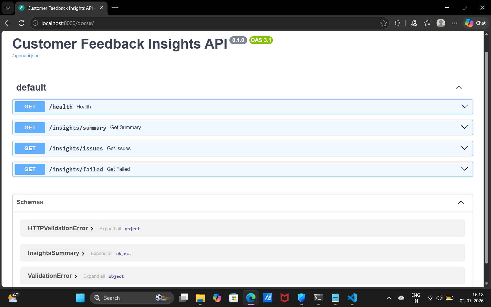
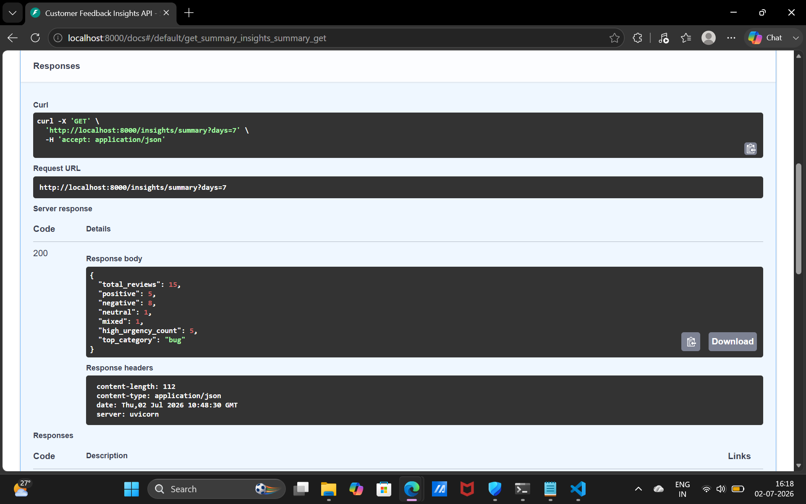
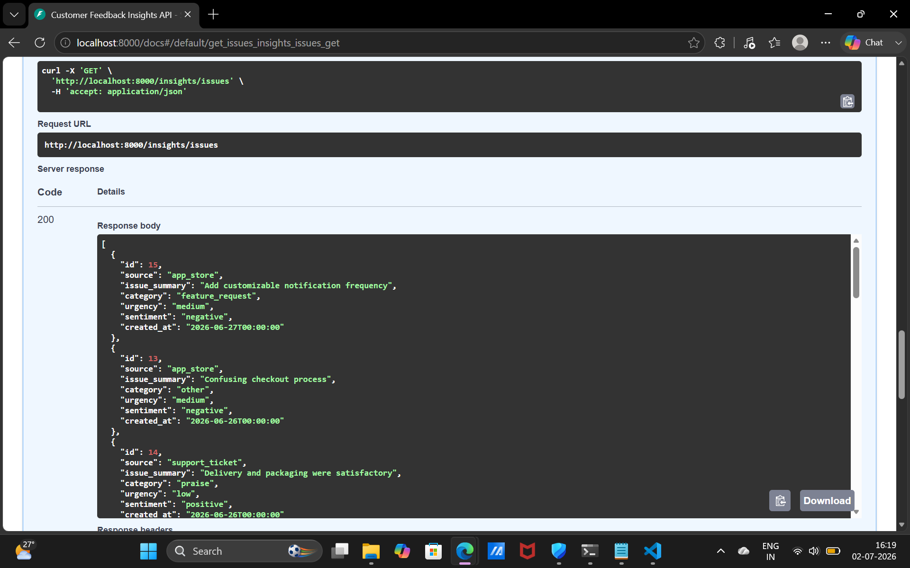

# Customer feedback insights pipeline

Turns unstructured customer feedback (reviews, support tickets) into structured,
queryable business insights using an LLM with enforced schema validation, backed
by Postgres with analytical SQL for trend and pattern analysis.

## The problem

Companies collect thousands of reviews and support tickets. Nobody reads them all.
This pipeline reads them automatically, extracts sentiment/category/urgency, and
serves the results as structured data a product team can actually query and act on.

## Demo



Sentiment and category breakdown:


Structured issue extraction from raw feedback text:


## Architecture

```
CSV / raw feedback
      |
      v
[ingestion.py] --clean text-->
      |
      v
[llm_service.py] --prompt + schema--> LLM API
      |
      v (validate against Pydantic schema, retry up to 3x on failure)
      |
      v
[database.py] --store structured record--> Postgres (Neon)
      |
      v
[main.py] --FastAPI endpoints--> /insights/summary, /insights/issues
      |
      v
[analytics.py] --window functions + CTEs--> /insights/analytics/*
```

## The core engineering problem this solves

LLMs don't reliably return valid JSON on every call. This pipeline:
1. Prompts the model to return only JSON matching a strict schema
2. Validates the response with Pydantic
3. Retries with backoff (up to 3x) if the response is malformed or fails validation
4. Flags records that still fail after retries for manual review instead of
   crashing the whole batch

This is the part worth explaining in an interview: reliability engineering
around an inherently unreliable component (the LLM), not just "call the API."

## The SQL layer

Beyond simple filters and aggregates, `analytics.py` runs genuinely non-trivial
SQL against the Postgres database:

- **Top category by week** - `ROW_NUMBER() OVER (PARTITION BY week ORDER BY count DESC)`
  to find the #1 issue type each week and how it shifts over time
- **3-day rolling sentiment trend** - a window frame (`ROWS BETWEEN 2 PRECEDING
  AND CURRENT ROW`) to smooth day-to-day noise and reveal genuine trend direction
- **Stale high-urgency issues** - a CTE computes the average age of high-urgency
  issues, then filters against that baseline in the same query, surfacing issues
  that have been sitting unresolved longer than typical

The database runs on **Neon** (serverless Postgres). Neon auto-suspends idle
compute to save cost, which can silently kill long-held connections - the engine
is configured with `pool_pre_ping=True` so SQLAlchemy transparently detects and
reconnects instead of throwing connection errors on the next request after a
period of inactivity.

## Running locally

```bash
pip install -r requirements.txt
cp .env.example .env   # add your NVIDIA_API_KEY and DATABASE_URL
python -m app.ingestion sample_data.csv
uvicorn app.main:app --reload
```

Then visit `http://localhost:8000/docs` for interactive API docs.

`DATABASE_URL` accepts either a Postgres connection string (e.g. from Neon,
Railway, or Supabase) or falls back to a local SQLite file if unset - useful
for quick local testing without provisioning a database.

## Endpoints

**Core**
- `GET /insights/summary` - aggregate stats (sentiment breakdown, top category, high-urgency count)
- `GET /insights/issues?urgency=high&category=bug` - filtered list of extracted issues
- `GET /insights/failed` - records that failed extraction after retries

**Analytics** (window functions & CTEs)
- `GET /insights/analytics/top-category-by-week` - weekly top issue category ranking
- `GET /insights/analytics/sentiment-trend` - 3-day rolling negative-sentiment average
- `GET /insights/analytics/stale-urgent-issues` - high-urgency issues older than average

## Running with Docker

```bash
docker build -t feedback-pipeline .
docker run -p 8000:8000 --env-file .env feedback-pipeline
```

## What I'd change to scale this

- Move ingestion from a synchronous script to a queue (Kafka/SQS) so it can
  handle high-volume, real-time feedback streams instead of batch CSV imports
- Add async processing with `asyncio` + batched LLM calls to cut latency
- Add a scheduler (Airflow/cron) to run ingestion continuously against a live
  data source instead of a one-off script
- Add indexes on `created_at`, `category`, and `urgency` as data volume grows,
  since the analytical queries filter/sort on these columns

## Tech stack

Python, FastAPI, SQLAlchemy, Pydantic, Postgres (Neon), NVIDIA NIM API, Docker
